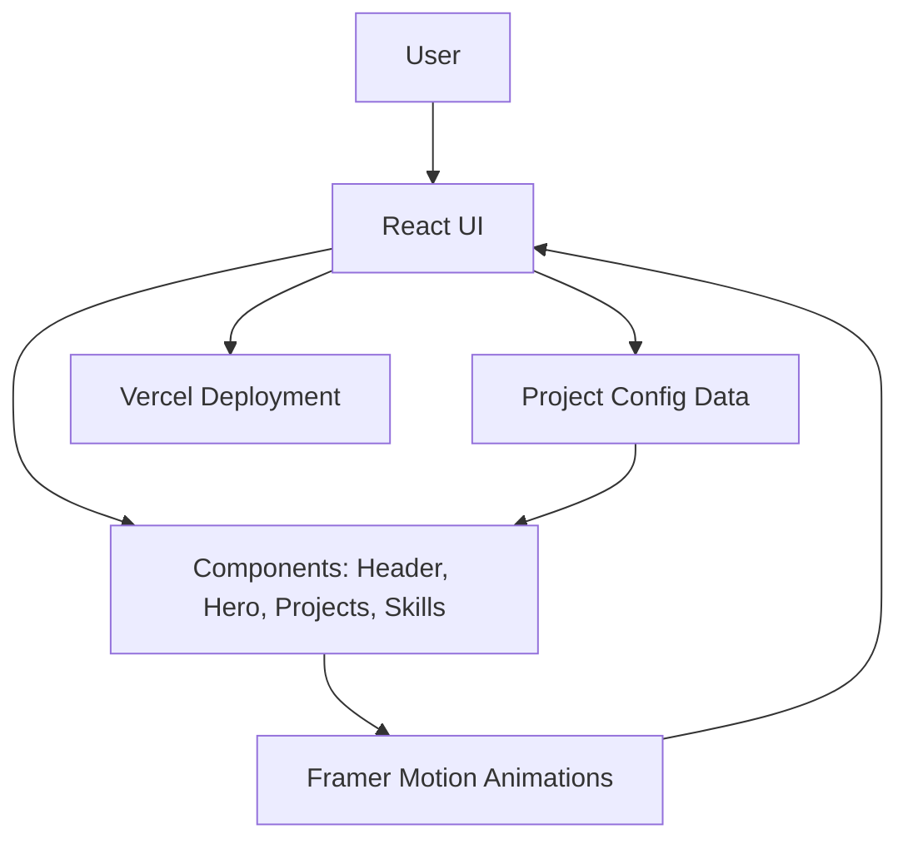

# Portfolio — Deepak Joshi


A modern developer portfolio built using **TypeScript**, **React**, and **Tailwind CSS**.
This portfolio showcases my projects, skills, experiences, and achievements with clean UI design, smooth animations, and modular components — optimized for performance and scalability.

---

## **Live Demo**

**Website:** [https://your-portfolio-link-here.com](https://portfolio-main-tan-three.vercel.app/)


---

# **Table of Contents**

1. [Overview](#overview)
2. [Features](#features)
3. [Folder Structure](#folder-structure)
4. [How to Run Locally](#how-to-run-locally)
5. [Architecture & Design Decisions](#architecture--design-decisions)

   * Component Architecture
   * Mermaid Diagram
6. [UI/UX Approach](#uiux-approach)
7. [Pipeline / Rendering Flow](#pipeline--rendering-flow)
8. [Challenges & Trade-Offs](#challenges--trade-offs)
9. [Performance & Deployment Notes](#performance--deployment-notes)

---

#  **Overview**

This repository contains my **personal developer portfolio**, built to present:

* My projects
* My skills
* My achievements
* My experience
* My social presence

The portfolio is built with a **modular configuration system**, where projects, skills, and experience can be updated from a single file — making it extremely easy to maintain.

The UI is fully responsive, supports animations, and is optimized for **ATS recruiters + hiring managers + technical reviewers**.

Core stack:

* **React** (UI Framework)
* **TypeScript** (type safety & maintainability)
* **TailwindCSS** (rapid styling)
* **Framer Motion** (animations)
* **Vercel** (deployment)

---

#  **Features**

### 🔹 Modern UI + Animations

Smooth transitions, hover effects, and motion-based interactions.

### 🔹 Dynamic Project Cards

Each project contains:

* Title
* Description
* Tech stack
* Icons
* Links
* Images

### 🔹 Fully Responsive Layout

Mobile, tablet, and desktop optimized.

### 🔹 Config-Driven Content

Easily add/update projects in a single file.

### 🔹 SEO-Optimized

Meta tags, OpenGraph, and clean semantic structure.

### 🔹 High Lighthouse Score

Optimized for performance, accessibility, and SEO.

---

#  **Folder Structure**

```
portfolio-main/
│
├── src/
│   ├── components/         # UI components (Cards, NavBar, Footer, Buttons)
│   ├── data/               # Project data, skill config, experience config
│   ├── pages/              # Landing, Projects, Contact, About
│   ├── assets/             # Images, icons
│   ├── styles/             # Tailwind global styles
│   ├── App.tsx             # Main app
│   ├── main.tsx            # Entry point
│
├── public/                 # Icons, favicon, static files
├── package.json
├── tailwind.config.js
├── tsconfig.json
├── README.md
```

---

#  **How to Run Locally**

## **1. Clone Repo**

```bash
git clone https://github.com/JoshiDeepak08/portfolio-main
cd portfolio-main
```

## **2. Install Dependencies**

```bash
npm install
```

## **3. Run Dev Server**

```bash
npm run dev
```

App opens at:

```
http://localhost:5173
```

## **4. Build for Production**

```bash
npm run build
```

## **5. Preview Production Build**

```bash
npm run preview
```

---

#  **Architecture & Design Decisions**

## **Why React + TypeScript?**

* Better maintainability
* Strong typing prevents runtime errors
* Scalable component architecture

## **Why TailwindCSS?**

* Utility-first CSS
* Fast UI development
* Consistent, theme-based design

## **Why Framer Motion?**

* Declarative animation system
* Smooth transitions
* Highly customizable

## **Why Vercel?**

* Zero-config deploy
* Instant global CDN
* Best for frontend frameworks

---

## **Mermaid Diagram**



---

#  **UI/UX Approach**

###  Clean + Minimal

Modern typography, whitespace, and contrast.

###  Visual Hierarchy

Projects > Skills > Experience > Contact

###  Component Reusability

Cards, badges, layouts, grids, buttons — all reusable.

###  Motion-Enhanced Interactions

Micro-animations for:

* Hover effects
* Section reveals
* Project card transitions

---

# **Pipeline / Rendering Flow**

### 1️⃣ User loads website → React renders initial page

### 2️⃣ Config data loads into components

### 3️⃣ Components use Tailwind classes for layout

### 4️⃣ Framer Motion animates sections

### 5️⃣ Vercel serves static site from CDN

---

# **Challenges & Trade-Offs**

### Challenge 1 — Maintaining multiple project images

✔ Solved by storing them in `/assets`.

### Challenge 2 — Balancing animations vs performance

✔ Light motion settings used.

### Trade-Off — Hard-coded config

Pros: Fast & simple
Cons: Requires manual updates

---

# **Performance & Deployment Notes**

* Built using **Vite** → Fastest dev server
* Deployed on **Vercel** → Zero downtime
* Tailwind ensures extremely small CSS bundle
* TypeScript catches UI errors early

---

